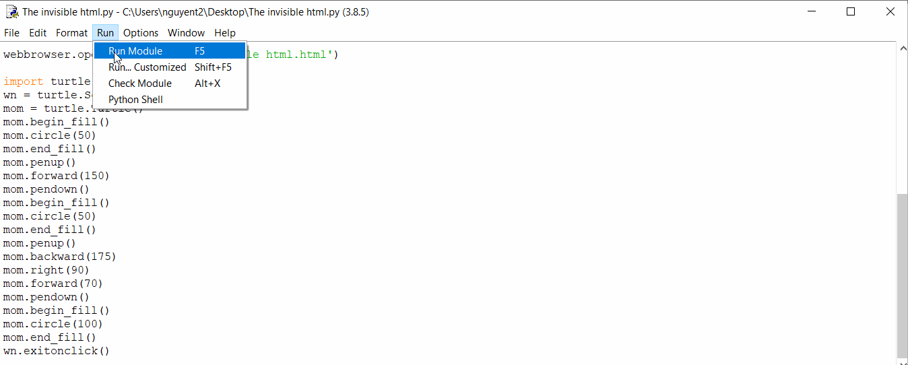

# The invisible .html
There is no .html file, but the .html file still gets opened through an only .py file.

https://molenathyhoangxuannguyen.github.io/Mickey-Mouse-and-Me/

## Demo

Here's a demo of this repository:

# What's next?
Exploring more features of html, css, and javascript opening through an only .py file.
